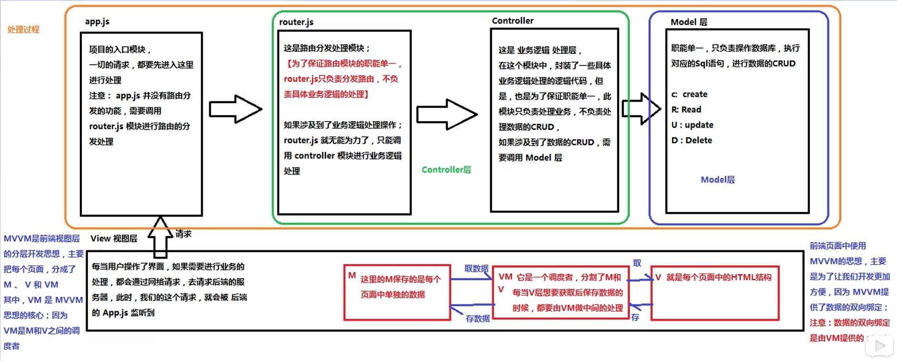

# vue.js 学习

> **为什么要学习流行框架?**
>
> ---
>
> - 企业为了提高开发效率，节省时间。
> - 增强自己就业时候的竞争力。
>
> ---

### 1.认识 Vue.js

- 为什么学习 Vuejs  
  国内外现在用的最多的语言，前后端分离。
- 简单认识 Vuejs  
  Vue 是一个渐进式框架，什么是渐进式？  
  渐进式意味着你可以将 Vue 作为你应用的一部分嵌入其中
  带来更丰富的交互体验。例如：一个项目中原来使用
  jquery，现在一部分重新构筑，这个时候重新构筑的
  这个部分就可以用 Vue 来实现渐进式构筑。

### 2.Vue.js 安装方式

- CDN 引入
- 下载和管理
- NPM 安装管理

### 3.Vue.js 初体验

- Hello Vuejs
- Vue 列表展示
- 案例：技术器

### 4.Vue.js 的 MVVM 架构

- Vue 中的 MVVM  
  

### 5.框架和库的去区别

- 框架  
  是一套完整的解决方案，对项目的侵入性较大
  项目如果需要更换框架，则需要架构整个项目。
- 库（插件）  
  提供某一个小功能，对项目的侵入性较小，
  如果某个库无法完成某些需求，可以很容易的切换到其他的库
  实现需求。

### 6.Vue 指令`v-on`的缩写和事件修饰符

v-on 的缩写：是@  
 事件修饰符：

- .stop 阻止冒泡
- .prevent 阻止默认事件
- .capture 添加事件监听时使用事件捕获模式
- .self 只当事件在该元素本身触发时回调
- .once 只触发一次

### v-model 双向数据绑定

只有`v-model`才可以实现数据的双向绑定

### 在 VUE 中使用样式

- 使用 class 样式

1. 数组  
   `<h1 :class="'red', 'thin'">H1</h1>`
2. 数组中使用三元表达式  
   `<h1 :class="'red', 'thin', {isactive?'active':''}">H1</h1>`
3. 数组中嵌套对象  
   `<h1 :class="['red', 'thin',{'active':, isactive}]">H1</h1>`
4. 直接使用对象
   `<h1 :class="{red:true, italic:true, active:true, thin:true}">H1</h1>`

- 使用内联样式

### 生命周期

- 生命周期函数: 组件创建期间的 4 个钩子函数。

```vuejs
  new Vue({
          el: '#app',
          data: {message: 'Hello Vue.js!'},
          methods: {},

          // 1.这是我们遇到的第一个生命周期函数 表示实例在完全被创建出来，会执行ta
          beforeCreate(){},/*** 注意：在beforeCreate 生命周期函数在执行的时候data和methods中的数据与都还没有初始化*/
          // 2.这是遇到的第二个生命周期
          created(){}, /*** 注意：在created data和methods 都已经被初始化好了*/
          // 3.这是遇到的第三个生命周期，表示模板已经在内存中编辑完成了，但是尚未把模板渲染到页面中去
          beforeMount(){},/*** 注意：在beforeMount 执行的时候，页面中的元素还没有真正的被替换过来，此时页面的值还是旧的值*/
          // 4.这是遇到的第四个生命周期，表示内存中的模板已经真是的挂载到了页面中，用户可以看到渲染好了的页面
          mounted(){}/*** 注意：在mounted 是实例创建期间最后一个生命函数，当执行完mounted 就表示，实例已经被完全创建好了
                               此时如果没有其他的操作的话，这个实例就静静的躺在内存中*/
      })
```

### vue-resource 实现 get，post，jsonp 请求

> 除了 vue-resource 请求，还有第三方`axios`第三方包实现 ajax 请求。

- 导入依赖  
  vue-resource.js 下载后放在 vuejs 下面，这个包依赖于 vuejs，实现 ajax 请求

json jsonp 的区别：目前只是知道 jsonp 可以跨域请求。
