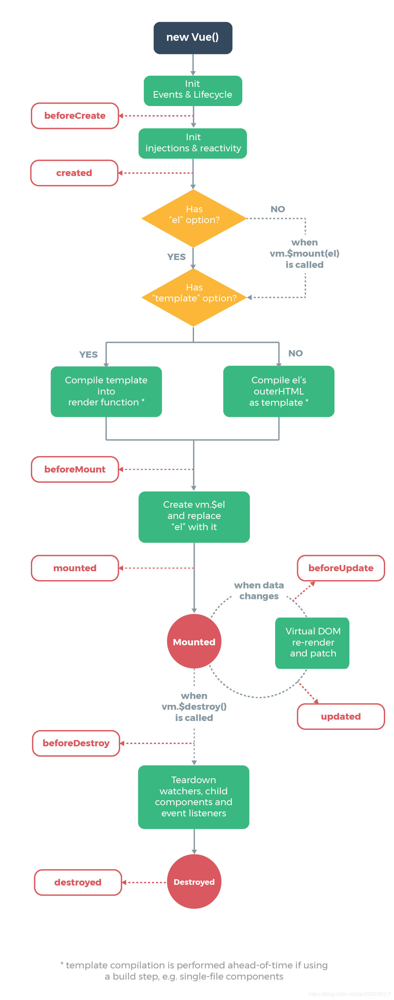

# vue生命周期和路由

* Vue.js （vue2.0）

~~~vue
<!DOCTYPE html>
<html>
<head>
<meta charset="utf-8">
<title>Vue 测试实例 - 菜鸟教程(runoob.com)</title>

</head>
<body>

{{ message }}

<input type="text" v-model="message">

</body>
</html>
~~~

* Vue.js(3.0)

~~~vue

~~~

## 一、生命周期钩子函数

### 1.beforeCreated

> 实例组件刚创建，元素和DOM元素还没有初始化。

### 2.created

> 数据data已经初始化完成，方法也可以调用，但是DOM未渲染。

### 3.beforeMounted

> DOM元素未挂载完成，数据也是刚初始化完成，但是数据的双向绑定还是显示{{}}，是因为vue采用了虚拟DOM技术。先占一个坑。

### 4.mounted

> 数据和DOM元素都已完成挂载，在上一个周期占位的坑，把值渲染进去，数据的初期加载可以在此请求，但是放在created那边更好一些，这个周期函数适合执行初始化操作DOM的方法。

### 5.beforeUpdate

> 只要页面数据发生改变都会触发，数据更新之前，页面还是原来的数据，当请求赋值一个数据的时候会触发这个周期，如果没有数据改变不执行。

### 6.updated

> 页面的数据改变了都会触发，数据更新完毕，页面上的数据是更新之后的，慎用·，和updated，因为页面更新数据的时候都会触发，在这里操作数据很容易造成死循环。

### 7.beforeDestory

> 这个周期函数在组件销毁之前执行。

### 8.Destoryed

> 这个周期函数在组件销毁之前执行。

## 二、路由

### 1.什么是路由？

> vue.js 路由允许我们通过不同的URL访问不同的内容。
>
> 通过vue.js可以实现多视图的web应用。

### 2.动态路由匹配

> 我们经常需要把某种匹配模式匹配到的所有路由，全部映射到同一个组件
>
> 例如：我们有一个User组件，对于所有ID不同的用户，都要使用这个组件来渲染
>
> 那么我们可以在Vue-router的路由中是同动态参数来达到这个效果。

~~~js
const User = {
    template: '
User
'
}

//----------------1----------------
const router = new VueRouter({
    routes: [
        // 动态路由参数 以冒号开头
        {path: '/user/:id', component: User}
    ]
})
//----------------2----------------
const User = {
    template: '
User {{ $router.params.id }}
'
}

~~~

*提醒一下：当是使用路由参数的时候，例如从/user/foo导航到/user/bar，原来的组件实例会被复用。因为两个路由同时渲染一个组件，比起销毁在创建则显得更加高效，不过这也就意味着组件的生命周期钩子函数不会再被调用，复用组件时，想对路由的参数变化做出响应的话，你可以简单的WATCH（监测）$router 对象*

~~~js
const User = {
    template: '
User {{ $router.params.id }}
'
    whtch: {
    	'$route' (to, from) {
            // 对路由的变化做出响应
        }
	}
}
~~~

### 3.嵌套路由

> 借助 vue-router，使用嵌套路由配置，就可以简单的表达这种关系。

~~~vue

    <router-view></router-view>

~~~

~~~js
const User = {
    template: '
User {{ $router.params.id }}
'
}

const router = new VueRouter({
    routes: [
        {path: '/user/:id', component: User}
    ]
})

~~~

*这里的`<router-view>` 是最顶层的出口，渲染高级路由匹配到的组件，同样的，一个被渲染的组件同样可以包含自己的嵌套`<router-view>`，要在嵌套的出口中渲染组件，需要在VueRouter 的参数中使用children 配置*

~~~js
const router = new VueRouter({
    routes: [
        {path: '/user/:id', component: User,
         children: [{
            // 当/user/：id/profile 匹配成功
            // UserProfile 会被渲染在 User 的<router-view>中
         	path: 'profile',
         	component: UserProfile
        },
    	{
            path: 'post',
            component: UserPost
        }]
        }
    ]
})
~~~

### 4.重定向与别名

> 重定向也是通过 routes 配置来完成的，下面的例子是从/a 重定向到/b

~~~js
const router = new VueRouter({
    routes: [
        {path: '/a', redirect: '/b'}
    ]
})
~~~

> 重定向也可以是一个命名的路由甚至一个方法

~~~js
//命名的路由
const router = new VueRouter({
    routes: [
        {path: '/a', redirect: {name: 'foo'}}
    ]
})

//一个方法
const router = new VueRouter({
    routes: [
        {path: '/a', redirect: to=> {
            // 方法接收
            // return 重定向的字符串/路径对象
        }}
    ]
})

~~~

## 三、MVVM实现原理

### 1.什么是MVVM？

> MVVM是双向数据绑定，==Model(**数据**)层→View(**视图**)层→ViewModel(**数据视图**)层==的响应式框架。
>
> 其中M(数据)是用来保存数据，VM(数据视图)连接数据和视图之间的调度者，V(视图)是前端HTML

